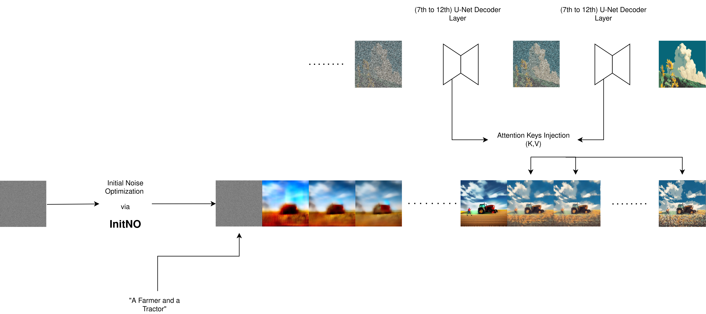

# StyleMerge Diffusion: A training-free approach to prompted and artistically accurate image generation

### About
Our method utilizes Stable Diffusion 2.1 with the diffusers implementation to generate artistically accurate images via a reference art image. It does so without fine-tuning/extra training via Attention key injection and Semantic Alignment via Intial Latent Noise Optimization.

### Pipeline of our Method:

  

### Samples generated with StyleMergeDiffusion
<div style="display: flex; justify-content: space-around;">
  
  
  
  
  
</div>

## Usage

**To run our code, please follow these steps:**

1. [Setup](#setup)
2. [Run StyleMerge](#run-stylemerge)
3. [Evaluation](#evaluation)

It requires 16GB memory GPU for float16 image generation.

#### Our implementation utilizes diffusers library [huggingface/diffusers](https://github.com/huggingface/diffusers)

## Setup

Our codebase is built on ([Jiwoogit/StyleID](https://github.com/jiwoogit/StyleID) and [Xiefan-guo/initno](https://github.com/xiefan-guo/initno)).

### Install the packages in native or virtual env

```
pip install -r requirements.txt
```

## Run StyleMerge

For running StyleMerge, run:

```
cd diffusers_implementation/
```
```
python3 run_styleid_diffusers.py --style_prompt None --gamma 0.9 --start 0 --timestep_thr 376 --ddim_steps 40 --save_dir ./output --sty_fn './data_vis/sty/flowersanime.png' --prompt "a rabbit and a turtle" --seed 42 --token_indices [2,5] --initno

```

To fine-tune the parameters, you have control over the following aspects in the style transfer:

- **Timestep of style injection** is controlled by the `--timestep_thr` parameter.
- **Attention-based style injection** is removed by the `--without_attn_injection` parameter.
- **Query preservation** is controlled by the `--gamma` parameter.
  (A higher value enhances content fidelity but may result a lack of style fidelity).
- **Attention temperature scaling** is controlled through the `--T` parameter.
- **Initial latent AdaIN** is removed by the `--without_init_adain` parameter.

## Evaluation

For a quantitative evaluation, we incorporated the CMMD evaluation metric that offers a more complete metric than FID [sayakpaul/cmmd-pytorch](https://github.com/sayakpaul/cmmd-pytorch) and also FID.

### CMMD
run:
```
cd evaluation;
python3 ./cmmd-pytorch/main.py ./cmmd-pytorch/reference_images/pixelart/ ../results/flowersanime --batch_size=32 --max_count=30000
```

### FID
run:
```
cd evaluation;
./evaluation/eval.sh
```
