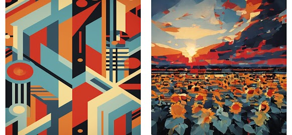

# StyleMerge Diffusion: A training-free approach to prompted and artistically accurate image generation

### [Paper] 
<div style="display: flex; justify-content: space-around;">
  
  
  
</div>

## Usage

**To run our code, please follow these steps:**

1. [Setup](#setup)
2. [Run StyleMerge](#run-stylemerge)
3. [Evaluation](#evaluation)

It requires 16GB memory GPU for float16 image generation.

#### ** You can also refer to "diffusers_implementation/" for StyleID implementation based on diffusers library. **

## Setup

Our codebase is built on ([Jiwoogit/StyleID](https://github.com/jiwoogit/StyleID) and [Xiefan-guo/initno](https://github.com/xiefan-guo/initno)).

### Install the packages in native or virtual env

```
pip install -r requirements.txt
```

## Run StyleMerge

For running StyleMerge, run:

```
python3 run_styleid_diffusers.py --style_prompt None --gamma 0.9 --start 0 --timestep_thr 376 --ddim_steps 40 --save_dir ./output --sty_fn './data_vis/sty/flowersanime.png' --prompt "a rabbit and a turtle" --seed 42 --token_indices [2,5] --initno

```

To fine-tune the parameters, you have control over the following aspects in the style transfer:

- **Attention-based style injection** is removed by the `--without_attn_injection` parameter.
- **Query preservation** is controlled by the `--gamma` parameter.
  (A higher value enhances content fidelity but may result a lack of style fidelity).
- **Attention temperature scaling** is controlled through the `--T` parameter.
- **Initial latent AdaIN** is removed by the `--without_init_adain` parameter.

## Evaluation

For a quantitative evaluation, we incorporate a set of randomly selected inputs from [MS-COCO](https://cocodataset.org) and [WikiArt](https://github.com/cs-chan/ArtGAN/tree/master/WikiArt%20Dataset) in "./data" directory.


Before executing evalution code, please duplicate the content and style images to match the number of stylized images first. (40 styles, 20 contents -> 800 style images, 800 content images)

run:
```
python util/copy_inputs.py --cnt data/cnt --sty data/sty
```

We largely employ [matthias-wright/art-fid](https://github.com/matthias-wright/art-fid) for the FID evaluation and [mahmoudnafifi/HistoGAN](https://github.com/mahmoudnafifi/HistoGAN) for HistoGAN.

### Art-fid
run:
```
cd evaluation;
python eval_artfid.py --sty ../data/sty_eval --cnt ../data/cnt_eval --tar ../output
```

### Histogram loss
run:
```
cd evaluation;
python eval_histogan.py --sty ../data/sty_eval --tar ../output
```

Also, we additionally provide the style and content images for qualitative comparsion, in "./data_vis" directory.

## Citation
If you find our work useful, please consider citing and star:

```BibTeX

@article{
}
```
