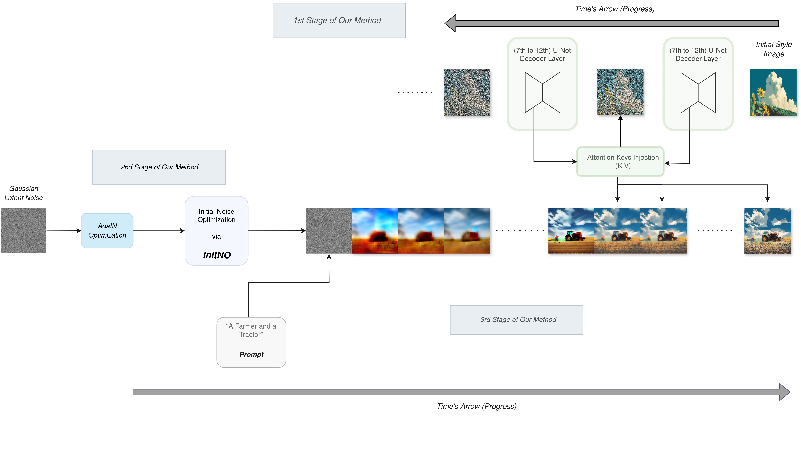
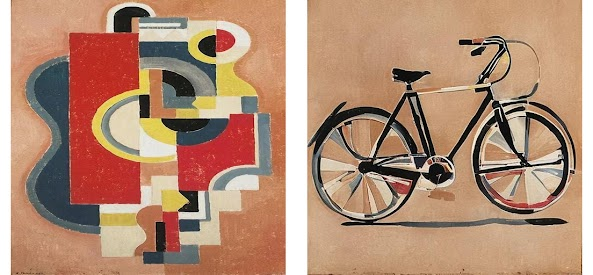
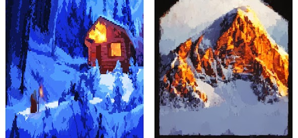

# StyleMerge Diffusion: A training-free approach to prompted and artistically accurate image generation

### About
StyleMerge Diffusion achieves artistically accurate image generation by transferring visual style from reference images to text-prompted content.Built on Stable Diffusion 2.1 and utilizing the diffusers library [huggingface/diffusers](https://github.com/huggingface/diffusers), It does so without fine-tuning/extra training via Attention key injection and Semantic Alignment via Initial Latent Noise Optimization.

### Pipeline of our Method:


  <picture>
    <source media="(prefers-color-scheme: dark)" srcset="./assets/stymerge_pipeline.png" width="700">
    <source media="(prefers-color-scheme: light)" srcset="./assets/stymerge_pipeline_light.png" width="700">
    
  </picture>
  <!---->

### Samples generated with StyleMergeDiffusion
<div style="display: flex; justify-content: space-around;">
  
  
  
  
  
</div>

## Usage

**To run our code, please follow these steps:**

1. [Setup](#setup)
2. [Run StyleMerge](#run-stylemerge)
3. [Evaluation](#evaluation)

### System Requirements
- GPU with 16GB VRAM (FP16 precision)
- Our implementation utilizes diffusers library [huggingface/diffusers](https://github.com/huggingface/diffusers)

## Setup

Our codebase is built on ([Jiwoogit/StyleID](https://github.com/jiwoogit/StyleID) and [Xiefan-guo/initno](https://github.com/xiefan-guo/initno)).

### Install the packages in native or virtual env

```
pip install -r requirements.txt
```

## Run StyleMerge

For running StyleMerge, run:

```
cd diffusers_implementation/
```
```
cd diffusers_implementation/
python3 run_styleid_diffusers.py \
  --style_prompt None \
  --gamma 0.9 \
  --start 0 \
  --timestep_thr 376 \
  --ddim_steps 40 \
  --save_dir ./output \
  --sty_fn './data_vis/sty/flowersanime.png' \
  --prompt "a rabbit and a turtle" \
  --seed 42 \
  --token_indices [2,5] \
  --initno
  
  ```

To fine-tune the parameters, you have control over the following aspects in the style transfer:

- **Timestep of style injection** is controlled by the `--timestep_thr` parameter.
- **Attention-based style injection** is removed by the `--without_attn_injection` parameter.
- **Query preservation** is controlled by the `--gamma` parameter.
  (A higher value enhances content fidelity but may result a lack of style fidelity).
- **Attention temperature scaling** is controlled through the `--T` parameter.
- **Removal of initial latent AdaIN normalization** is controlled by the `--without_init_adain` parameter.

## Evaluation

For a quantitative evaluation, we incorporated the CMMD evaluation metric that offers a more complete metric than FID [sayakpaul/cmmd-pytorch](https://github.com/sayakpaul/cmmd-pytorch) and also FID.

### CMMD
run:
```
cd evaluation
python3 ./cmmd-pytorch/main.py \
  ./cmmd-pytorch/reference_images/pixelart/ \
  ../results/flowersanime \
  --batch_size=32 \
  --max_count=30000
```

### FID
run:
```
cd evaluation;
./evaluation/eval.sh
```

### Acknowledgements

The authors gratefully acknowledge the use of resources (GPU Cluster) provided by the National Infrastructures for Research and Technology (GRNET).
